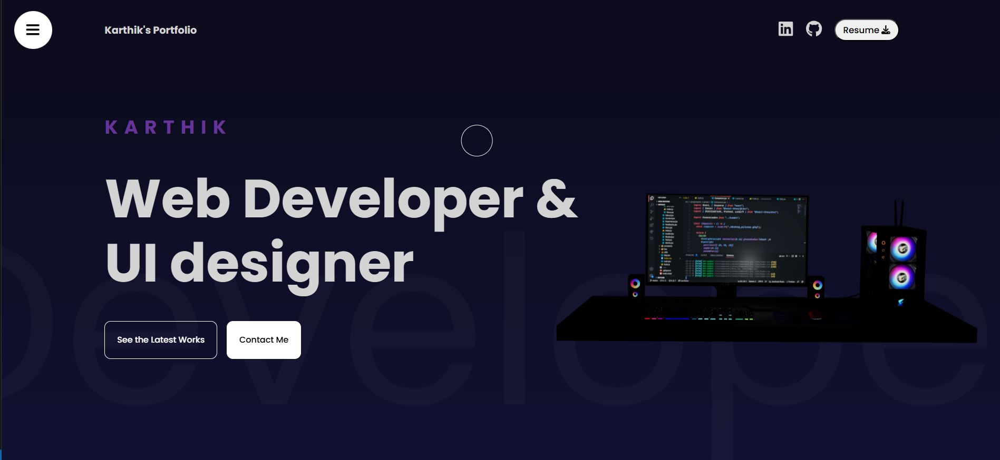

# Welcome to my Portfolio 

## Overview
My portfolio is a modern, fully responsive personal website built using React.js and Framer Motion. It serves as a dynamic platform to showcase my technical skills, featured projects, and professional background in an interactive and visually appealing way.  
  
The site incorporates smooth scroll-based animations, including parallax effects, animated progress bars, and interactive UI elements to enhance user experience. Each project is highlighted with detailed descriptions, technology stacks, GitHub repositories, and live demo links for real-time exploration. Additionally, the skills section features animated cards that present my tech proficiencies in an organized and visually engaging layout.

## Tech Used
- HTML5, JavaScript (Fundamental web tech)
- SCSS (Styling)
- React.js (Functional Components & Hooks)
- Framer Motion (Animations & Scroll-based effects)
- React Three Fiber
- React Three/Drei
- React Loading Indicators
- Sweet Alert2
- React Icons (Technology Icons)
- 3D Model for Visuals

## Features 
- **Parallax Scrolling Effects:** Layers of planets, stars, and mountains animated on scroll using Framer Motion.
- **Project Showcase:** Displays featured works with images, descriptions, technology icons, and links to source code and demos.
- **Technical Skills:** Interactive skill cards that reveal detailed skills and technologies upon selection.
- **Responsive Design:** Works smoothly on desktops, tablets, and mobile devices.
- **Progress Indicator:** Scroll progress bar to visualize navigation through projects.
- **Clean Code Architecture:** Functional React components with hooks, modular SCSS styling, and reusable motion variants.
- **3D Model (Computer):** The animated 3D computer serves as a powerful visual anchor in the hero section, instantly grabbing attention. Used compressed/light-weight model for reliable usablity.
- **Downloadable Resume:** A resume download option is available in the navbar, allowing recruiters and visitors to access it with one click.
 
### Check out the live demo 👉&nbsp;[My Portfolio](https://myportfolio-sandy-three-92.vercel.app)

